<h1 align="center"> Application to Manage Notes </h1>

<p align="center">
  <a href="#Introducao"> 🧩 Introdução </a>&nbsp;&nbsp;&nbsp;|&nbsp;&nbsp;&nbsp;
  <a href="#Dependencias"> 🧪 Dependências</a>&nbsp;&nbsp;&nbsp;|&nbsp;&nbsp;&nbsp;
  <a href="#Aplicacao"> 🚀 Aplicação</a>&nbsp;&nbsp;&nbsp;|&nbsp;&nbsp;&nbsp;
  <a href="#Licensa"> 📝 License</a>&nbsp;&nbsp;&nbsp;&nbsp;&nbsp;&nbsp;
</p>

<a id="Introducao"></a>
## 🧩 Introdução

### Um Backend completo utilizando Node.js e Express para uma aplicação de gerenciamento de anotações. A API foi construida com o banco de dados <a href="https://www.sqlite.org/">SQLite</a>, e para a manipulação do nosso Banco de Dados foi utilizado a ferramenta <a href="https://www.beekeeperstudio.io/">Beekeeper Studio</a> juntamente com o Query Builder <a href="https://knexjs.org/">Knex.js</a>. Para cadastrar nossas rotas e verificar os status codes das mesmas foi utilizado o <a href="https://insomnia.rest/">Insomnia</a>. 

### A aplicação deve ser capaz de lidar com requisições, feitas pelos clientes, conseguir processar essas requisições e então devolver respostas para quem as solicitou.

### 1. O que é uma API?

API - Application Programming Interface, ou Interface de Programação de Aplicação, é um termo para designar uma interface de comunicação que um sistema oferece para que outros acessem suas funções.

<div align="center">
  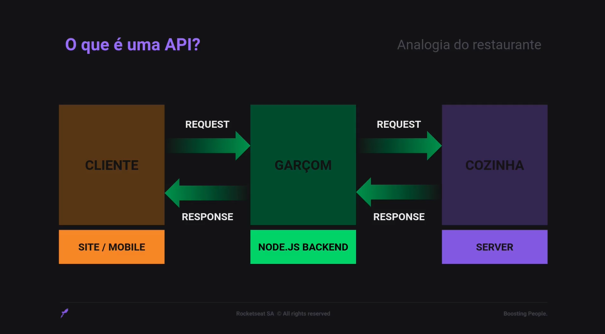
</div

### 2. O que é o Node.js?

Ele é um JS Runtime Enviroment - um ambiente que oferece recursos que permite escrever e executar aplicações JavaScript.

### 3. Onde o Node.js pode ser utilizado?

<div align="center">
  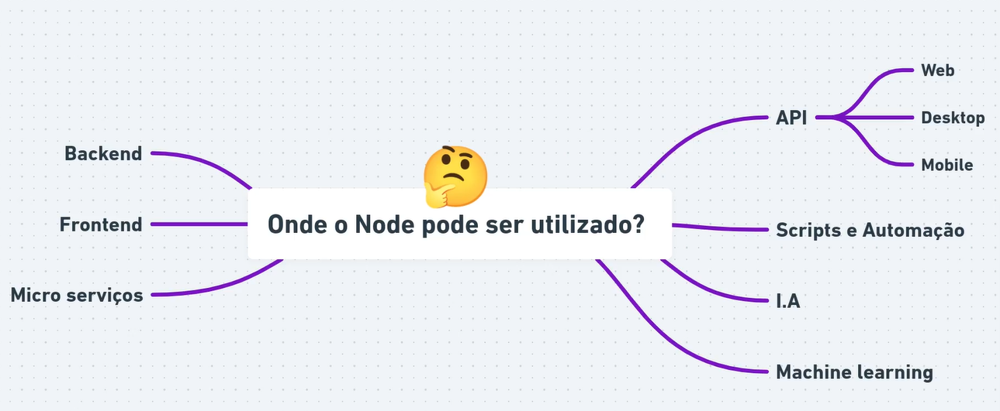
</div>

#### 4. Quais as vantagens?

Temos várias aplicações de ponta usando o Node.js pelos seguintes motivos:

<div align="center">
  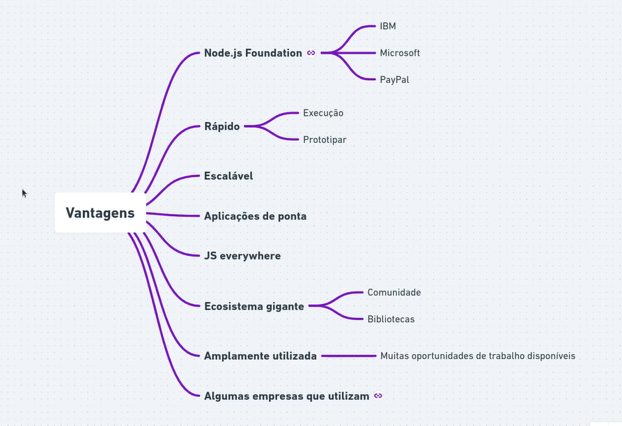
</div>

### 5. v8 Engine

O v8 é um interpretador JavaScript. Desenvolvido pelo Google e utilizado em seu navegador Google Chrome. O v8 é desenvolvido em C++ com o objetivo de aumentar a performace de execução do JavaScript.

### 6. O funcionamento do Node.js

<div align="center">
  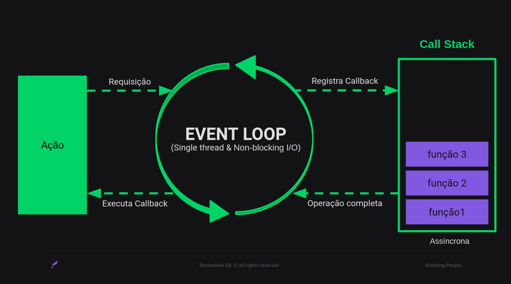
</div>

### 7. Express

O Express é um framework web muito rápido e flexível para a gente utilizar nas nossas aplicações Node para lidar com requisições feitas através da web, através do protocolo HTTP, também lidar com requisições, com respostas e por aí vai.

### 8. Métodos HTTP

Para se comunicar com uma API é necessario seguir alguns padrões. É aí que entram os métodos de requisições, também chamados como verbos HTTP, e são esses:

<div align="center">
  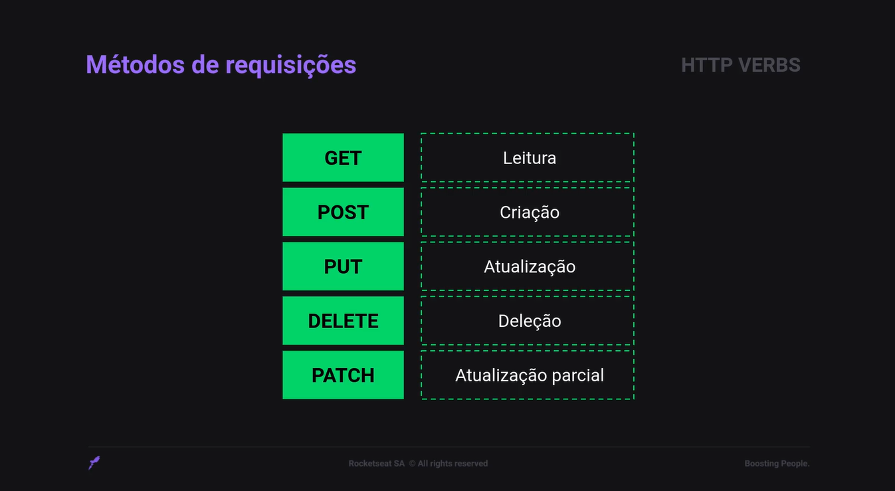
</div>

<br />

- GET para dizer ao nosso backend que queremos ler algum tipo de informação;
- POST para realizar a criação de alguma informação na aplicação;
- PUT para atualizar uma informação na aplicação;
- DELETE para deletar, ou seja, excluir uma informação;
- PATCH para fazer uma atualização expecífica de alguma informação.

<a id="Dependencias"></a>
## 🧪 Dependencias
> Requisitos para rotar o código.

- [JavaScript](https://developer.mozilla.org/pt-BR/docs/Web/JavaScript)
- [Node.js](https://nodejs.org/en)
- [Express](https://expressjs.com/pt-br/)
- [Express Async Erros](https://www.npmjs.com/package/express-async-errors)
- [Nodemom](https://nodemon.io/)
- [Bcryptjs](https://www.npmjs.com/package/bcryptjs)
- [Knex](https://knexjs.org/)

<a id="Aplicacao"></a>
## 🚀 Aplicação

### Instalação e inicialização do projeto

### ```COMANDOS```

#### Para instalar as dependências
```
 npm install
```

#### Para rodar o projeto
```
 npm run dev
```

### Em um novo terminal, use esse comando para rodar as migrations
```
  npm run migrate
```

### ```Estrutura do Banco de Dados```

<div align="center">
  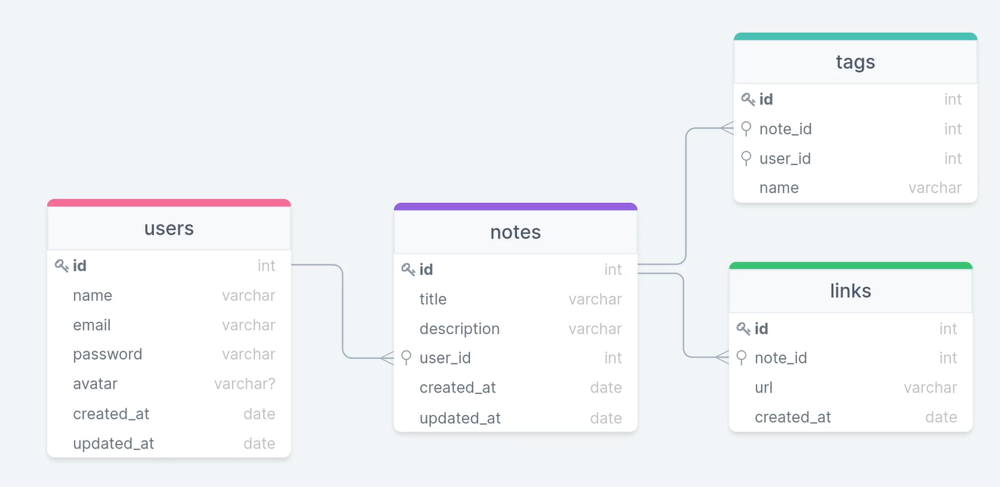
</div>

### ```Query Builder```

Os bancos de dados relacionais utilizam o mesmo padrão de linguagem de consulta que é o SQL, porém é natural que de um banco de dados para outro, mesmo que sendo relacional, tenha algumas diferenças. Então, a gente preciso adotar uma estratégia para gerar códigos SQL de forma independente do banco. E é aí que entra a Query Builder.

Um Querr Builder é um construtor de consulta que permite gerar instruções SQL de maneira independente do banco de dados que for utilizando.

O que a Query Builder faz é gerar o código SQL para o banco de dados utilizado. Ao invés de escrever o código SQL específico para o banco, é escrito utilizando a síntese do Query Builder. A vantagem é que, caso seja necessario fazer um select, um insert, um update, utilizamos o Query Builder para gerar o código SQL para o banco de dados.

Outra vantagem é que o Query Builder vai gerar um código performático, deixando as consultas bem estruturadas para o banco de dados utilizado. Nesse projeto utilizamos o Query Builder <a href="https://knexjs.org/"/>Knex.js</a>.

### ```Migrations```

As migrations são uma forma de versionar o nosso banco de dados, elas trabalham na manipulação da base de dados, seja alterando, criando ou removendo informações.

Para criar uma migration, usamos o camando:

```
 npx knex migrate:make nome_da_migration
```

Para executar a migration, para criar ela dentro do banco de dados, usamos o comando:

```
 npx knex migrate:latest
```

Porém, temos um script expecifico para isso, basta executar:

```
 npm run migrate
```

### ```Insomnia```

No Insomnia crie uma 'Request Collection' e a chame de RocketNotes.

Para criar uma requisição, clique no botão com o símbolo de '+' no canto superior a esquerda e escolha a opção 'HTTP Request', depois você pode renomear a requisição para qual ação você for utilizar, como por exemplo: 'User Create', em seguida, troque o método para o tipo da ação que você deseja realizar, como por exemplo: 'POST' e digite o endereço que a aplicação está rodando. Depois, abaixo na opção 'Body' escolha o formato 'JSON' para poder enviar informações no corpo da requisição. Para executar, clique no botão 'Send'.

<div align="center">
  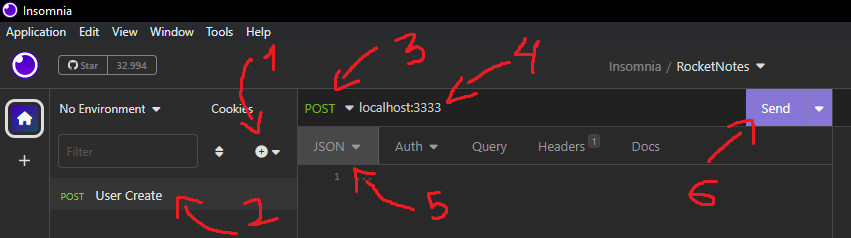
</div>

Também é possivel organizar as rotas em pastas e configurar variáveis se ambiente no Insomnia. Para criar uma variável de ambiente, clique na opção de 'No Environment' e clique na opção 'Manage Environments'. Apois isso clique no botão de '+' e clicar em 'Environment' para adicionar um novo, onde podemos por exemplo criar o ambiente de 'dev' de desenvolvimento. Nesse ambiente podemos definir a nossa 'BASE_URL', podendo acessa-la em qualquer lugar.

<div align="center">
  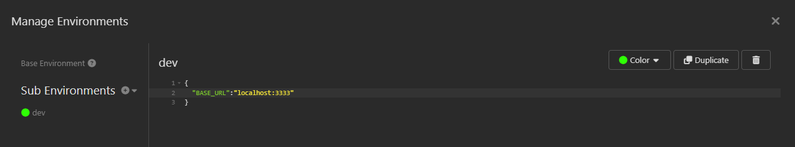
</div>

Depois podemos usar ele, selecionando na opção de 'No Environment' e atualizando o endereço da API para a variavel de ambiente.

<div align="center">
  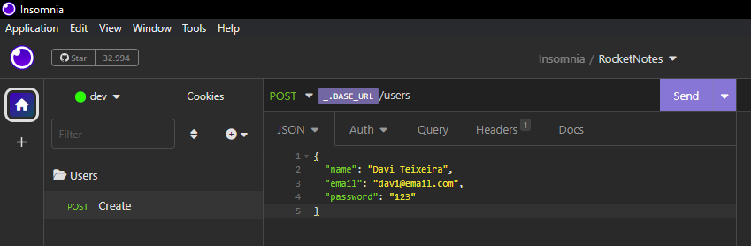
</div>

Podemos transformar os recursos em variaveis, podendo chama-los em lugares expecíficos, como por exemplo, clicar na pasta de users com o botão direito e escolher a opção de 'Environment', onde podemos chamar ela de 'RESOURCE':

<div align="center">
  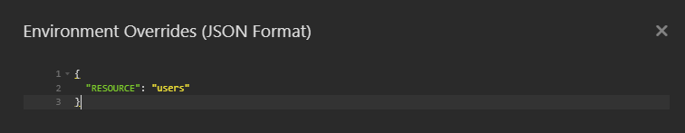
</div>

A variável de ambiente que é criada dentro de uma pasta só é disponivel para a mesma.

<div align="center">
  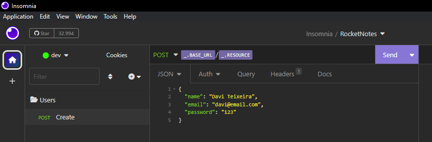
</div>

<br />

```Para testar as funcionalidades no Insomnia```

### Para testar a criação de um usuário. Crie uma pasta Users, faça uma requisição do tipo 'POST' chamada 'Create', com a url: localhost:3333/users e escolha o 'JSON' como corpo da requisição. Desta forma você pode criar um usuário, como no exemplo abaixo:
```
{
	"name": "Davi",
	"email": "davi@email.com",
	"password": "123"
}
```

### Para testar a atualização de um usuário, na pasta Users, faça uma requisição do tipo 'PUT' chamada 'Update', com a url: localhost:3333/users/1 e escolha o 'JSON' como corpo da requisição. Desta forma você pode atualizar o usuário (atualize o id de acordo com o user), como no exemplo abaixo:
```
{
	"name": "Davi Teixeira",
	"email": "davi@email.com",
	"password": "1234",
	"old_password": "123"
}
```

### Para testar a criação de uma nota de usuário. Crie uma pasta Notes, faça uma requisição do tipo 'POST' chamada 'Create', com a url: localhost:3333/notes/1 e escolha o 'JSON' como corpo da requisição. Desta forma você pode criar uma nota para o usuário com id = 1, como no exemplo abaixo:
```
{
	"title":"Introdução Nodejs.",
	"description": "Essa é uma nota de exemplo.",
	"tags": ["node", "express"],
	"links": ["link1", "link2"]
}
```

### Para testar a rota que exibe todas as notas de um usuário, faça uma requisição do tipo 'GET' chamada 'Index', com a url: localhost:3333/notes/ e nas query params adicione os valores de id, title e tags. Como no exemplo abaixo:
```
http://localhost:3333/notes?title=node&user_id=1&tags=node
```

### Para testar a funcionalidade que mostra uma nota expecifica, na pasta Notes, faça uma requisição do tipo 'GET' chamada 'Show', com a url: localhost:3333/notes/1. Desta forma você pode ver a nota do usuário 1 (atualize o id de acordo com o user).

### Para testar a funcionalidade de deletar uma nota, na pasta Notes, faça uma requisição do tipo 'DELETE' chamada 'Delete', com a url: localhost:3333/notes/1. Desta forma você deleta as notas do usuário 1 (atualize o id de acordo com o user).

### Para testar a funcionalidade que mostra as tags da nota de um usuário, crie uma pasta Tags, faça uma requisição do tipo 'GET' chamada 'Index', com a url: localhost:3333/tags/1. Desta forma você pode ver as tags do usuário 1 (atualize o id de acordo com o user).

<a id="Licensa"></a>
## 📝 License

Este projeto possui uma Licença MIT License - veja o arquivo [LICENSE](./LICENSE) para mais detalhes.

<div align="center">
  Made with ❤️ by Davi Teixeira
</div>
